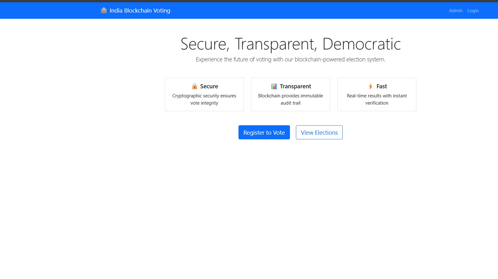
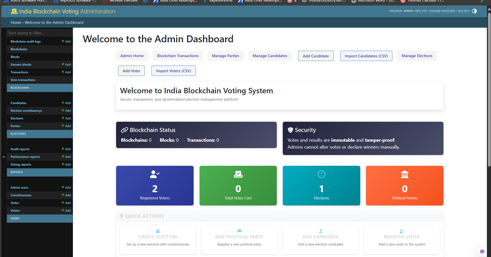
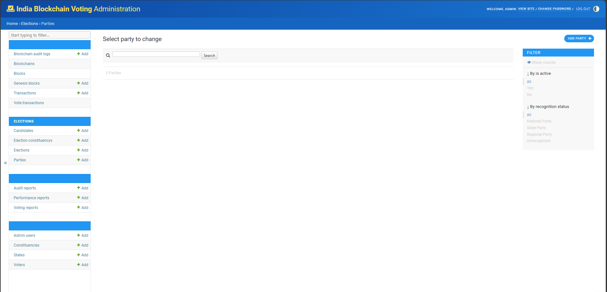
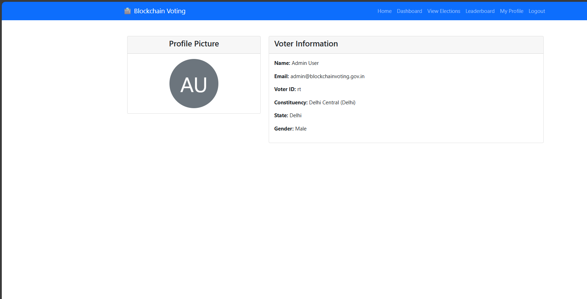

# India Blockchain Voting System

A comprehensive, decentralized, secure blockchain-based voting system for Indian elections.

## Features

- **Blockchain-Backed Voting**: Every vote is securely recorded on a tamper-proof blockchain
- **Secure Authentication**: JWT-based authentication with voter ID verification
- **Digital Receipts**: Anonymous digital receipts for each vote
- **Election Management**: Admin tools for managing elections, candidates, and voters
- **Real-time Results**: View live election results and statistics
- **Voter Protection**: Prevents duplicate voting and ensures voter privacy
- **Admin Controls**: Ban/unban users, parties, and candidates; host elections
- **CSV Import/Export**: Import voters and candidates in bulk

## System Architecture

The system is built using the following components:

- Backend: Django (Python)
- Database: MySQL
- Authentication: JWT with custom user model
- Blockchain: Custom implementation with proof-of-work consensus
- Frontend: Bootstrap-based responsive UI

## Setup Instructions

### Prerequisites

- Python 3.10+
- MySQL Server
- pip and virtualenv

### Installation

1. Clone the repository:

```bash
git clone https://github.com/your-username/india-blockchain-voting.git
cd india-blockchain-voting
```

2. Create a virtual environment and activate it:

```bash
python -m venv venv
source venv/bin/activate  # On Windows: venv\Scripts\activate
```

3. Install dependencies:

```bash
pip install -r requirements.txt
```

4. Configure the MySQL database:

```
# Create a .env file in the root directory with the following:
SECRET_KEY=your_secret_key
DEBUG=True
USE_SQLITE=False
DB_NAME=blockchain_voting
DB_USER=your_db_user
DB_PASSWORD=your_db_password
DB_HOST=localhost
DB_PORT=3306
```

5. Run migrations:

```bash
python manage.py migrate
```

6. Create a superuser:

```bash
python manage.py create_admin_user
```

7. Import locations data:

```bash
python manage.py seed_locations
```

8. Import dummy data:

```bash
python manage.py seed_dummy_voters --count 100 --output voters.csv
```

9. Run the development server:

```bash
python manage.py runserver
```

10. Access the application at http://localhost:8000

## Admin Access

1. Log in with your admin credentials at http://localhost:8000/admin/
2. You can:
   - Create and manage elections
   - Add/import voters
   - Add/import parties and candidates
   - Ban/unban users, parties, candidates
   - View blockchain data and validate transactions

## Voter Workflow

1. Register with your voter ID
2. Log in to your account
3. View available elections
4. Cast your vote when an election is open
5. Receive a digital receipt
6. View election results when published

## Images


# As we see in Admin Dashboard too that it is restriceted to access Blocks and Blockchain as it must not be tampered thats why



## Note
This is still under development by [Aditya Upadhyay](https://github.com/op2adi)
It is not complete yet


## License

This project is licensed under the IIITD License.
And Reference Paper 
[IEEE Explore link](https://ieeexplore.ieee.org/stamp/stamp.jsp?tp=&arnumber=8457919)